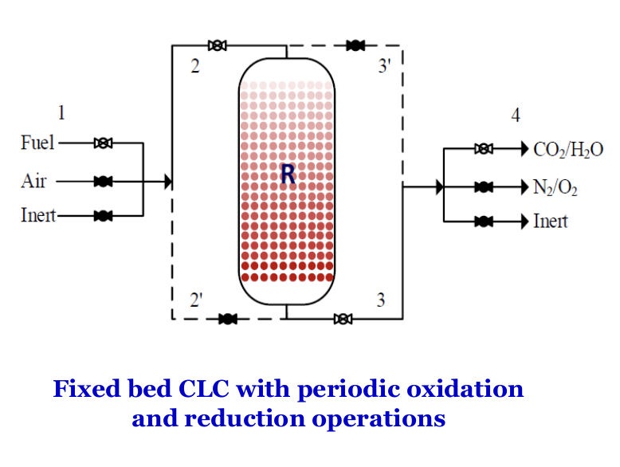

## 前言

- 化學循環燃燒(Chemical Looping Comubustion, CLC)是碳捕捉技術之一，可獲得高濃度二氧化碳。

- 使用交替操作之固定床 CLC 可操作於高壓，且免除固體循環流動之操作困難。

- 本研究在 Matlab 平台建立一個固定床 CLC 之一維非均相動態數學模式，模擬甲烷燃燒步驟之性能，並進行氧載體參數
  影響分析。

## 結論

- 氧載體密度愈高，達到甲烷反應物貫穿的時間愈長。

- 氧載體初始氧化態濃度(kgNiO/kgOC)愈高，達到甲烷反應物貫穿的時間愈長，反應器溫度因水氣轉移反應之發生而降得
  過低，使得氧載體之轉化率無法提高。

- 固體比表面積之改變對反應器出口之濃度分佈、氧載體轉化率與溫度分佈影響均不顯著。
